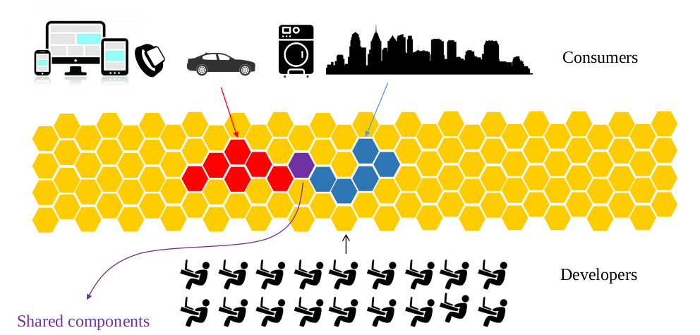

<!--Themed-->

The rise of computer networks is pushing for an evolution of computing, where the software and IT functionalities accessed by consumers are implemented as systems of inter-connected components that collaborate with each other. These components, called <strong>services</strong>, are deployed on infrastructures like the cloud, which enable developers to abstract considerably from the details of hardware support (like which computer is running which component).

From the point of view of developers and consumers, IT infrastructures are starting to look like "seas of services".

details of which computer is running which software component, and the network that supports the integration of services and a that  abstract from the gritty details of which computer is running each component Developers can deploy these components in a "

is changing the way that we make software.
Technologies like computer networks, cloud computing, and containerisation have been progressively pushing for an evolution of computing, where 

# Further reading

Here we list two main articles from [DZone](https://dzone.com/) where we illustrate our idea for the future of software development in the cloud.

# From a computation machine to a coordination machine
_Containerization and cloud computing are leading us to a new way we are conceiving computational resources_ 

Historically, computer machines were developed for automatizing computation. Starting from abacus to modern computers, the main idea behind computer machines was to increase the power of human brain computation with an external device. Computation machines were theoretically modeled by Alan Turing using his Turing machine and their basic architecture was proposed by Von Neumann.

[_Read more..._](https://dzone.com/articles/the-new-computer-machine)

# The red pill of (micro)services
_Why we need new programming languages for dealing with the new coordination machine?_ 

The reason is very simple and intuitive: usual programming languages like C, Java, Python, etc, were developed for facilitating computation programming, not coordination programming. In these languages indeed, communication and coordination are always achieved by exploiting specific libraries or external frameworks, they are not crystallized within the linguistic structure of the programming language. 

[_Read more..._](https://dzone.com/articles/the-red-pill-of-microservices)

